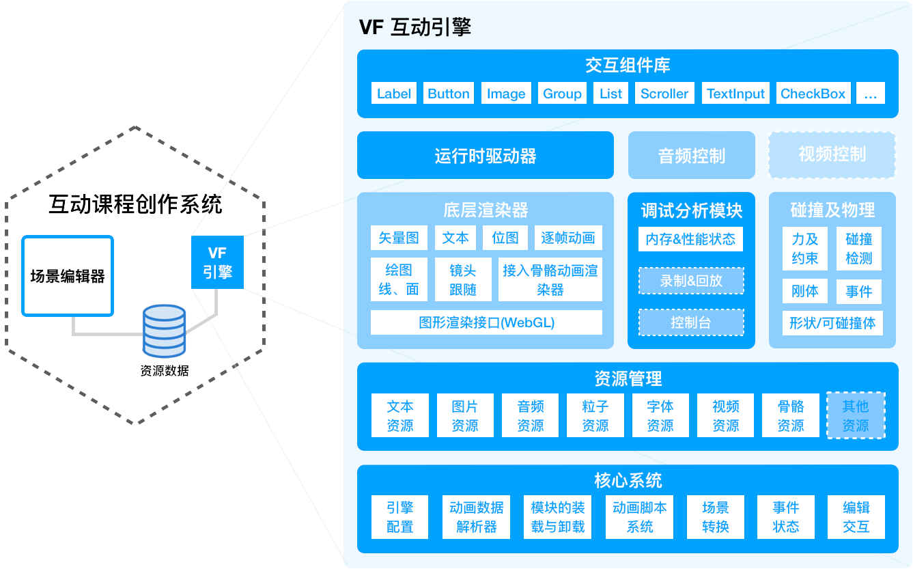

## 引擎介绍

VF 引擎是一套用于快速构建互动教学场景的解决方案中的图形交互引擎，引擎的设计并不是 **「重复发明轮子（*Reinventing the wheel*）」**，而是基于行业内比较成熟、优秀的方案做的改造与封装。

其中[渲染模块]()就是基于业内最轻量与超快的[Pixi](https://www.pixijs.com/)渲染引擎做的封装改造...

与其它引擎/框架不同的是，VF 被设计为类似FlashPlayer一样插件应用。VF 的核心只关注将场景数据渲染为可交互的视图层，不仅易于上手，还便于与既有项目整合。

VF 引擎致力于完成一套统一跨平台的高性能互动课程制作系统，它能够支持 **Web**、**iOS**、**Android**、**Node**、**桌面应用** 和 **小程序** 不同环境下的图形绘制和各种互动教学场景。

::: tip 提示
VF默认使用WebGL2渲染，初始化时检测到低端设备或不支持的浏览器会自动降级为Canvas2d。
:::

## 特性 <Badge text="Beta"/>
- 高性能UI系统—GUI，通过底层设计的优化精简，在呈现丰富UI效果的前提下大幅度减少内存占用和性能消耗。
- 支持CSS属性，控制UI、字体样式，设定Grid布局等就像修改DOM样式一样简单。
- 灵活的插件扩展，无论是交互动画、滤镜特效、还是UI组件、功能逻辑都可以自由定义并配置使用。
- 渲染系统采用自动脏刷新技术结合超轻快的PIXI改造，表现出最优运行性能。
- 支持完善的矢量绘图API，动态创建丰富的教学图形。
- 完备的资源管理系统，各种类型的资源轻松配置，灵活加载。
- 完整的屏幕适配策略，内置四种适配策略，让应用在各种设备的屏幕上都可以智能以最佳状态呈现。
- 高效的物理引擎，绚丽的粒子系统，以及龙骨的支持，开发各种类型的教学互动场景都游刃有余。
- 提供完善的音频系统，无论是音频播放、录音交互、语音测评都是随配随用。
- 提供完善的视频系统，随时随处控制视频为教学场景增加丰富的吸引力。
- 海量的题型模版、互动场景、交互动画、富媒体组件..只需配置JSON即可实现快速复用。

## 架构图解

- 上图可见整套互动课程创作系统核心的就是**编辑器**、**数据**与**VF引擎**，编辑器生产数据，引擎消费数据。
但是在没有编辑器的前提下我们依然可以编写制作互动场景，现阶段如果您也有这方面的需求可以了解下一节如何开发。