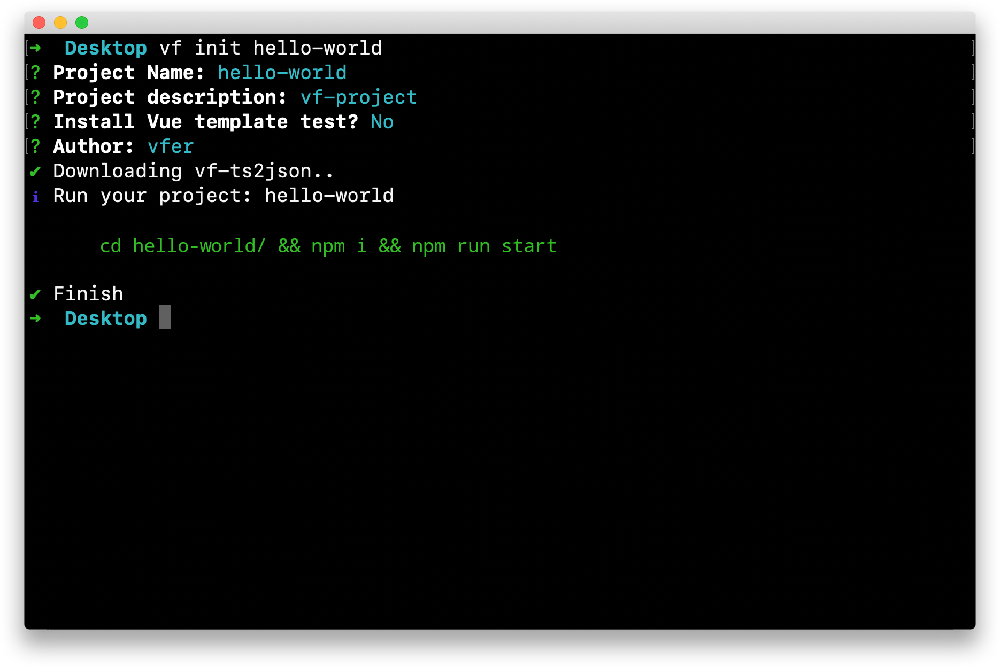
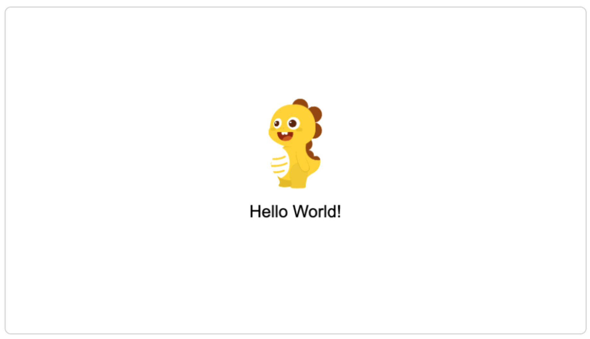

# 安装运行


## 安装 VF-CLI 

使用 VF 的方式有多种，其中最快速上手的是用 VF-CLI 脚手架来搭建 VF 的开发环境。
VF-CLI 是个脚手架，便于开发者快速使用 VF 上手。
只需要几分钟的时间就可以运行起来带有热重载、运行时 Typescript 类型校验，以及产出 VF 引擎所必须的 JSON 数据文件。

更多详情可查阅 [VF-CLI](https://github.com/vipkid-edu/vf-cli) 的文档。

::: tip 提示💡
等你了解 VF 整体的运行和解析机制后，完全可以摒弃 VF-CLI ，按照自己的方式搭建开发环境。
不过目前，我们先来使用 VF-CLI 来构建开发环境
:::

**将 VF-CLI 安装到全局:**

```shell script
npm install -g @vf.js/cli
```
> 安装的过程中，如果提示权限问题，可能会需要你用到 ```sudo npm install -g vf-cli``` 方式安装
    
安装之后，你就可以在命令行中访问 ``vf`` 命令。你可以通过简单运行 ``vf``，看看是否展示出了一份所有可用命令的帮助信息，来验证它是否安装成功。

你还可以用这个命令来检查其版本是否正确：
```shell script
vf --version
```

## 创建一个项目

使用 vf-cli 创建一个名为 "hello-world" 的 VF 项目
```shell script
vf init hello-world
```

按照上述命令行操作后，输入项目的基本信息，并按照自己的需求灵活配置, 最终效果可能如下图所示:
<br/>  


**安装依赖和启动项目:**
```shell script
cd hello-world/ && npm i && npm run start
```



## 项目结构
用编辑器打开 `hello-world` 项目，可以看到大概如下的目录结构：
```javascript
hello-world
├── build
├── src
|   └── index.ts
|   └── scene.ts
|   └── store.ts 
|   ├── assets.ts
|   └── global.ts 
|   └── components.ts
├── types
|   └── Style.ts
|   ├── Action.ts
|   ├── Component.ts
|   ├── IVFTemplate.ts
├── vf-json
|   └── index.json
├── index.html
├── t2j.config.json
├── tsconfig.json
└── README.md
```
**项目核心结构概览:**

* `/build`：放置了项目的构建编译配置模块

* `/src`: 项目的业务文件，开发者在这里编写业务逻辑。**大部分时间你的关注点都会在此。**

* `/types`: 内置的 VF Typescript 模块

* `/vf-json`: 项目启动后，会将 ``hello-world/src`` 下的 `*.ts` 文件即时编译成 VF 引擎运行所需要的 JSON 文件, 默认存放在此

* `/index.html`:  包含引擎模块的网页，在这里可以将 `*.ts` 文件产出的 json 引入进来，启动一个 httpServer 后便可以即时的调试和预览

* `hello-world/t2j.config.json`: 编译配置文件, 在这里配置项目的入口文件以及产出的 `JSON` 文件输出路径等，详情请参阅 [TS2JSON](https://github.com/vipkid-edu/vf-ts2json)

::: tip 提示
等你熟悉项目后，完全可以按照自己的想法灵活创建项目，项目中其他未介绍到的目录结构随着你对 VF 的深入自然会了解，现在你只需要将注意力放在上述核心结构上。
:::

至此，我们的项目就算是生成好了，下一篇让我们一起看看项目的内部构造吧！

