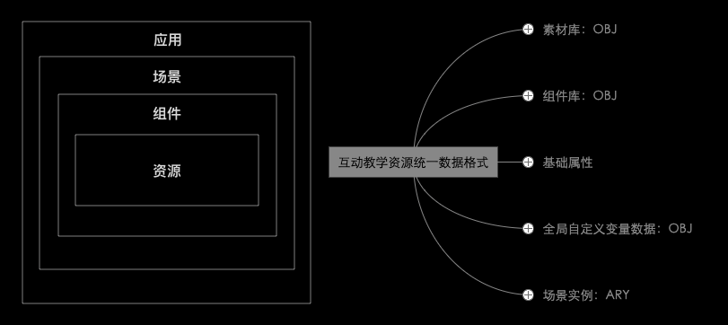

# 数据格式

用一套数据格式来描述所有互动场景并可支持未来对功能的扩展，从而覆盖所有教学场景。
设计理念简而言之就是由`((资源 > 交互组件) + 功能组件) > 场景` 及对应属性组成的一套教学资源数据。

[数据结构](https://naotu.baidu.com/file/31d88d6860e2f2d1f1c77a85806ee64f?token=5d508053eb862955)

### 名词解释
- [**资源：**](resource.md) 图片、字体、音频、视频、纹理描述、SVG、脚本等资源文件，每个资源对应一个url。例如：jpg的图片，mp3音频文件。
- [**组件：**](component.md) 组件是对资源的进一步包装，组件分为基础UI组件，动画组件，媒体组件，扩展组件，矢量绘制组件，自定义组件，六大类。
    + [**GUI组件：**](component-gui.md) 包含容器，表格，图片，按钮，单选框，复选框，输入框，滑动条，文本...。
    + [**动画组件：**]() 包含龙骨动画，序列图动画，粒子动画三种动画组件。
    + [**媒体组件：**]() 包含视频播放，音频播放，麦克风等媒体相关的组件。
    + [**扩展组件：**]() 根据组件规则定制的外部插件。
    + [**矢量绘制组件：**]() 包含svg组件和绘制组件两种。
    + [**自定义组件：**]() 组件 + 动画 + 动作行为 = 自定义组件。 自定义组件是一个容器，可以放置所有类型的组件。自定义组件包含动画数据，动作行为脚本数据，和内部变量数据。
- [**场景：**](scene.md) 自定义组件 + 转场 = 场景。场景就是自定义组件，只是多了个转场特效，用于制作互动故事书或者场景转换。
- [**课件：**]()场景 + 场景 + .. = 课件。课件包含一个或者多个场景。一个课件对应一个数据文件。
- [**动画：**](animation.md)动画就是元件属性随时间的变化。动画数据中包含了时间轴数据和帧数据。动画数据和组件数据分离，通过组合的方式完成动画，可以更灵活方便的制作动画。
- [**动作行为：**]()动作行为就是代码，动作行为必须依托于自定义组件之上，不能独立存在，动作行为的生命周期和自定义组件的生命周期相同，就是从自定义组件加入舞台开始，到自定义组件移除舞台结束。动作行为是一个数组，数组中的每项是一个动作项，一个动作项包含属性 type，target， execute，express等属性，一个动作项就是一个代码块。
- [**变量：**]()在动作行为中用到的变量，有全局变量和自定义组件的局部变量两种，两者的作用域不同。
- [**数据：**]()外部动态数据/参数。

### 数据格式说明
<div class="panelHeader pdl mt1"><b>v0.2.10</b></div>

```js
{
   //教学资源名称
   "name": "test",
   //数据格式版本
   "version":"0.2.10",
   //资源原始宽度，来至编辑器设置
   "width": 1280,
   //资源原始高度，来至编辑器设置
   "height": 720,
   //帧率
   "fps":30,
   //适配模式 “noScale|showAll|cover|contain”
   "scaleMode":"contain",
   //场景资源预加载模式 “single|all”
   "loadMode":"single",
   //资源根路径 ["https://xxx.xxxx.xxx/xxx", "file:///xxx/xxx", "../xxx/xx"]
   "baseUrl": "https://xxx.xxxx.xxx",
   //自定义全局变量数据
   "global": {
      //自定义参数数据 "number|string|boolean|array|object"
      "aaa": 0|"aa"|false|[]|{},
      "bbb": {
         "type":"number|string|boolean|array|object",
         "value":0|"bb"|false|[]|{},
      },
   },
   //资源库
   "assets":{
      "asset_id": {
         //资源名称
         "name":"",
         //资源类型
         "type":"text|image|audio|video|font|js",
         //相对baseURL的地址
         "url":"",
      },
   },
   //组件库，用来存放当前项目中的所有组件
   "components": {
      "component_id": {
         //组件名称
         "name": "",
         /*组件类型：
            1.基础UI组件"container|table|image|button|radio|checkbox|input|slider|text|.."
            2.动画组件"dragonbones|particle|sheet|"
            3.媒体组件"video|audio|microphone|"
            4.扩展组件"extend"
            5.矢量绘制组件"svg|graphic"
            6.自定义组件"custom"
         */
         "type": "custom",
         //关联资源
         "assets": [0,1],
         //默认字段以及属性，每种组件的属性不相同，另附表说明
         "props": {
            //自定义参数数据 "number|string|boolean|array|object"
            "aaa": 0|"aa"|false|[]|{},
            "bbb": {
                "describe":"bbb用处描述",
                "type":"number|string|boolean|array|object",
                "value":0|"bb"|false|[]|{},
            },
         },
         //默认样式布局，已支持的样式请查看样式表说明
         "style": {},
         //子组件（仅自定义组件）
         "children": [
            {
               "id": "children_0",
               "componentId": "component_1",
               //样式，另附表说明
               "style": {},
            }
         },
         //动画（仅自定义组件）
         "animations": [
            {
               "name": "default",
               "duration": 200,
               "children": {
                  //这组件中children里的实例id
                  "children_0": {
                     "duration": 100,
                     "loop": true,
                     "timelines": [
                        {
                           "type": 'x',//x,y,scale,rotation,color...
                           "loop": true,
                           "frames": [
                              {
                                 "frame": 0,
                                 "value": 2,
                                 "curve": [1],//动画曲线，预置曲线或贝塞尔曲线
                              }
                           ]
                        }
                     ]
                  },
               },
            }
         ],
         //动作行为（仅自定义组件）
         "actionList": [
            { //事件表项
               "type": "addToStage",//当加入到舞台时执行
               "execute": [//执行的事件表
                  {
                     "type": "expression",//表达式
                     "express": ["variableId", "=", false],//变量variableId = false；
                  },
               ]
            },
            {
               "type": "animationComplete",//当动画播放完毕时
               "execute": [//执行的事件表
                  {
                     "type": "stop",//停止动画
                     "target": "this",//当前组件
                  }
               ]
            },
            {
               "type": "click",//当点击时执行
               "target": [41],//当前组件的子组件，当点击该child时执行
               "execute": [//执行列表
                  {
                     "type": "play",//播放动画
                     "target": [41],//前组件的子组件
                     "params": ["default", 1],//播放名为default的动画，播放1次
                  },
                  {
                     "type": "expression",//表达式
                     "express": ["variableId", "=", true],//变量variableId = true；
                  },
                  {
                     "type": "wait",//等待
                     "time": 2000,//等待2000毫秒
                  },
                  {
                     "type": "jumpTo",//跳转场景
                     "sceneId": "successScene",//跳转到id为successScene的场景
                  }
               ]
            },
            {
               "type": "enterframe",//每帧执行
               "execute": [],
            }
         ],
      },
   ],
   //场景，场景就是一个自定义组件加一个转场特效
   "scenes":[
      {
         "id":80,//场景的id
         "libId":36,//自定义组件的id
         "transition":{
            "type":1,//淡入淡出，百叶窗等
            "duration":30
         },
         "assets": [0, 3, 8, 11],
      }
   ],
}
```